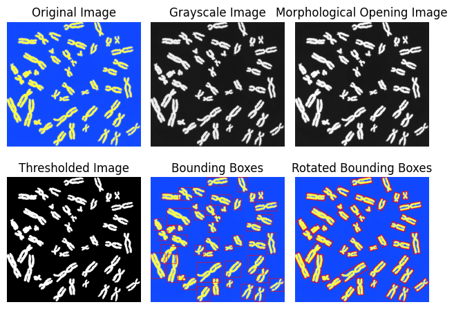

# Machine Learning and Pattern Recognition

## Lab 1 - Chromosome Feature Extraction

### By Niksh Hiremath (ID: U20240158)

---

---

## Aim

The aim of this lab is to extract meaningful geometric features from a chromosome image so that they can be used as inputs to a Machine Learning model.

Each detected chromosome is represented using the following features:

- Height
- Width
- Area
- Perimeter
- Circularity

The final output is a 2D dataset where:

- Each row represents one chromosome
- Each column represents a feature

---

## Methodology

1. The chromosome image was loaded using OpenCV and visualized.

2. The image was converted to grayscale to simplify processing.

3. Morphological opening was applied to remove background noise and improve object separation.

4. Thresholding was performed to convert the image into a binary format.

5. Contours were detected to identify individual chromosome objects.

6. For each detected chromosome, a bounding box was constructed and the following features were extracted:
   - Height and Width (from bounding box)
   - Area
   - Perimeter
   - Circularity

7. All extracted features were stored in a structured DataFrame.

8. Standardization and normalization were applied to scale the features.

---

## Visual Outputs

---

## Standardization

Standardization was applied to transform all features to have:

- Mean ≈ 0
- Standard Deviation ≈ 1

This ensures that features with larger magnitudes (such as Area and Perimeter) do not dominate smaller-scale features.

### Observation after Standardization

After standardization:

- All features are centered around zero.
- Scale differences are removed.
- Features become comparable for ML algorithms.

---

## Normalization

Min-Max normalization was applied to scale all features between 0 and 1.

### Observation after Normalization

After normalization:

- All feature values lie within the range [0, 1].
- Relative differences between samples are preserved.
- The dataset becomes suitable for distance-based algorithms.

---

## Key Findings

- Contour detection effectively identifies chromosome objects.
- Morphological operations improve segmentation quality.
- Area and Perimeter strongly relate to Height and Width.
- Circularity provides shape information and helps differentiate elongated structures.
- Feature scaling is essential before applying ML models.

---

## Conclusions

This lab demonstrates the complete pipeline from image processing to feature extraction and data preprocessing.

Key conclusions:

- Raw images can be converted into structured numerical datasets.
- Geometric features provide meaningful descriptors for chromosomes.
- Standardization and normalization improve data quality and model compatibility.
- The extracted dataset can be used for classification or clustering of chromosomes.

---
