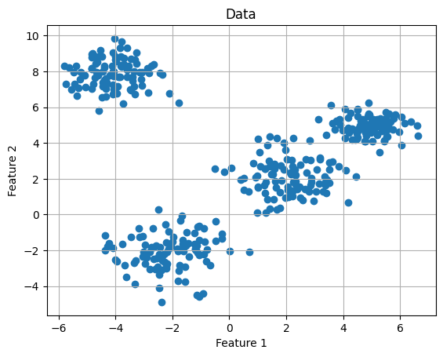
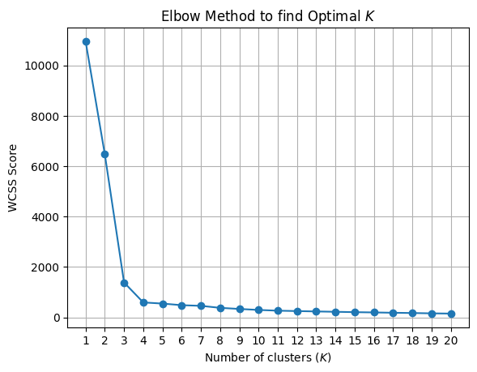
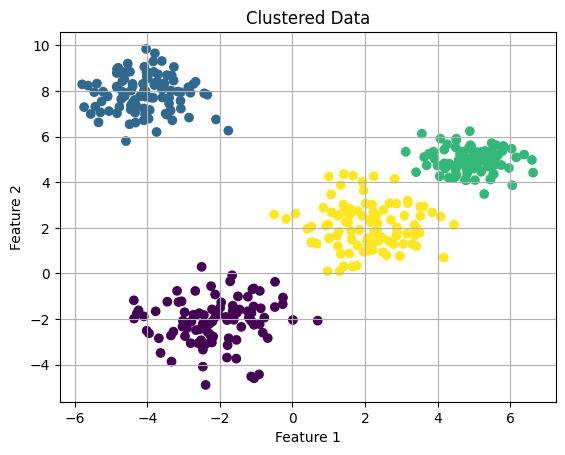

# Machine Learning and Pattern Recognition

## Lab 2 - K-Means Clustering and Elbow Method

### By Niksh Hiremath (ID: U20240158)

---

---

## **Aim**

The aim of this lab is to generate synthetic multivariate Gaussian data and apply the **K-Means clustering algorithm** to identify the optimal number of clusters using the **Elbow Method**. The task involves computing the Within-Cluster Sum of Squares (WCSS) for values of K ranging from 1 to 20 and determining the most suitable number of clusters.

---

## **Methodology**

1. **Data Generation**
   - Four Gaussian distributions were defined using specified mean vectors and covariance matrices.
   - Random samples were generated from each distribution using `np.random.multivariate_normal()`.
   - A fixed random seed (`np.random.seed(0)`) was used to ensure reproducibility.
   - All samples were stacked into a single dataset.

2. **Elbow Method**
   - K-Means clustering was applied for values of K from 1 to 20.
   - For each K, the Within-Cluster Sum of Squares (WCSS) was computed.
   - WCSS values were plotted against K to identify the “elbow point”.

3. **Final Clustering**
   - Based on the elbow plot, K = 4 was selected.
   - K-Means clustering was performed with 4 clusters.
   - The clustered data was visualized.

---

## **Visualizations**

### 1. Generated Data Plot

This plot shows the synthetic dataset before clustering.

---

### 2. Elbow Method Plot

The elbow curve shows a sharp decrease in WCSS up to K = 4, after which the decrease becomes gradual. This indicates that 4 clusters are optimal.

---

### 3. Clustered Data Plot (K = 4)

After applying K-Means with K = 4, the algorithm correctly separates the data into four distinct clusters.

---

## **Key Findings**

- WCSS decreases as the number of clusters increases.
- A clear elbow is observed at **K = 4**, indicating the optimal number of clusters.
- When K is too small, distinct clusters are merged.
- When K is too large, clusters become fragmented and may capture noise.
- Proper centroid initialization improves convergence and clustering quality.
- Outliers can significantly increase WCSS and distort clustering boundaries.
- The Elbow Method may not always provide a sharp elbow when clusters overlap or are not well separated.

---

## **Conclusions**

The K-Means algorithm successfully identified the underlying structure of the synthetic dataset. The Elbow Method clearly indicated that **4 clusters** are optimal, which matches the number of Gaussian distributions used to generate the data.

This experiment demonstrates that:

- K-Means is effective for well-separated Gaussian clusters.
- The Elbow Method is a practical approach for selecting K.
- Initialization and data quality influence clustering performance.
