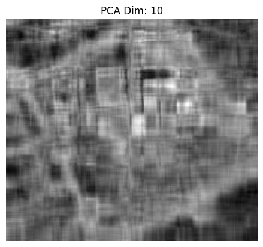
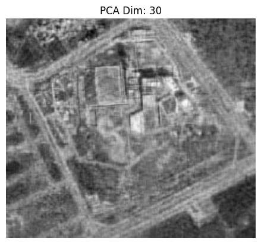
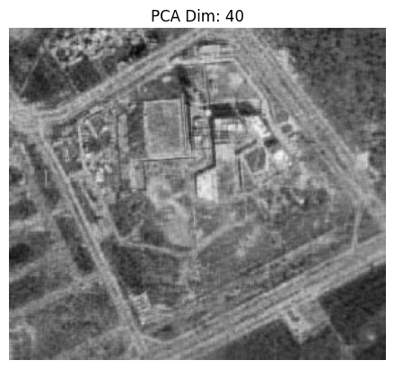
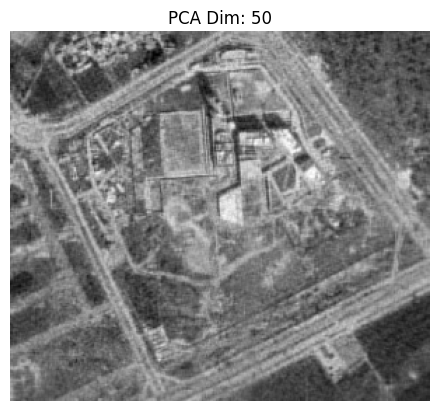

# Machine Learning and Pattern Recognition

## Lab 3 - Principal Component Analysis on Satellite Image

### By Niksh Hiremath (ID: U20240158)

---

---

## Aim

The aim of this lab is to implement Principal Component Analysis from scratch using NumPy and apply it to a satellite image. The objective is to reduce image dimensionality while preserving maximum variance and reconstruct the image using different numbers of principal components.

---

## Dataset

The experiment is performed on a satellite image of Plaksha University campus.

### Original Image

---

## Methodology

1. Import required libraries such as OpenCV, NumPy, and Matplotlib.
2. Load the satellite image using OpenCV.
3. Convert the image to grayscale.
4. Convert pixel values to float64 for numerical computation.
5. Compute the mean of each column and subtract it to center the data.
6. Compute the covariance matrix using NumPy.
7. Calculate eigenvalues and eigenvectors using `np.linalg.eig()`.
8. Sort eigenvectors in descending order of eigenvalues.
9. Select different numbers of principal components.
10. Project the image data onto selected components.
11. Reconstruct the image using selected principal components.
12. Compare reconstructed images for different component values.
13. Use sklearn PCA to verify that around 91 components explain approximately 95 percent variance.

---

## PCA Reconstruction Results

The image was reconstructed using the following number of principal components:

- 10
- 20
- 30
- 40
- 50
- 60
- 91
- 300 (for reference)

### Dimensionality Reduction using PCA

| PCA Dim 10                       | PCA Dim 20                       | PCA Dim 30                       |
| -------------------------------- | -------------------------------- | -------------------------------- |
|  |  |  |

| PCA Dim 40                       | PCA Dim 50                       | PCA Dim 60                       |
| -------------------------------- | -------------------------------- | -------------------------------- |
|  |  |  |

| PCA Dim 91                       | PCA Dim 300 (reference)            |
| -------------------------------- | ---------------------------------- |
|  |  |

---

## Key Findings

- With very low components such as 10 or 20, the image appears highly blurred and loses structural details.
- As the number of components increases, the reconstruction quality improves significantly.
- Around 60 components, major structural features such as roads and buildings become clearly visible.
- At 91 components, the reconstructed image closely resembles the original image.
- Using sklearn PCA, it was verified that approximately 91 components explain around 95 percent of the total variance in the dataset.
- PCA effectively compresses image data while retaining most important information.

---

## Conclusion

Principal Component Analysis reduces the dimensionality of the satellite image while preserving essential structural information.

The reconstruction results show that increasing the number of principal components improves image clarity and detail retention. Around 91 components are sufficient to retain approximately 95 percent of the variance, making PCA an effective technique for image compression and dimensionality reduction.
