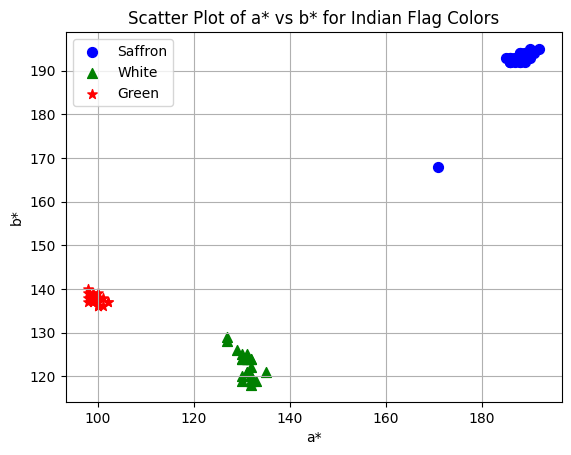
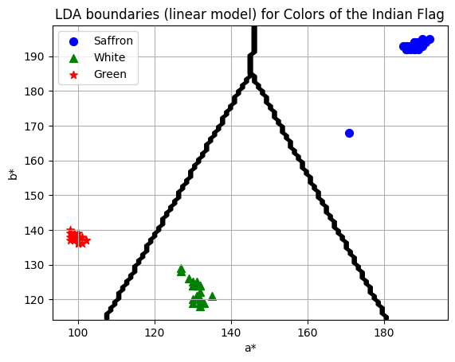

# Machine Learning and Pattern Recognition

## Lab 4 - Linear Discriminant Analysis for Color Classification

### By Niksh Hiremath (ID: U20240158)

---

## Aim

The aim of this lab is to implement **Linear Discriminant Analysis (LDA)** to classify the three colors of the Indian flag using feature space representation.

The objectives are:

- Extract color samples from the image
- Represent colors in the a*–b* feature space
- Compute LDA projection directions
- Plot decision boundaries between classes
- Evaluate class separability visually

---

## Methodology

The following steps were performed:

1. Extract sample pixel values corresponding to Saffron, White, and Green regions from the flag image.
2. Convert color values into the L\*a\*b\* color space.
3. Use a\* and b\* components as features.
4. Compute class means and scatter matrices.
5. Apply Linear Discriminant Analysis to determine separating hyperplanes.
6. Plot the scatter distribution and LDA decision boundaries.

---

## Input Image

The original image used for sampling color values:

---

## Scatter Plot of a\* vs b\*

The scatter plot below shows the distribution of Saffron, White, and Green samples in the a*–b* feature space:

**Observations:**

- Saffron samples cluster in the higher a\* and b\* region.
- Green samples cluster in lower a\* and moderate b\* values.
- White samples form a separate compact cluster.
- The classes show good visual separability in the feature space.

---

## LDA Decision Boundaries

The LDA model generates linear boundaries separating the three color classes:

**Observations:**

- The boundaries are linear as expected from LDA.
- Each class region is clearly partitioned.
- Minimal overlap is observed between clusters.
- The discriminant directions effectively maximize inter-class variance.

---

## Key Findings

- The a\* and b\* features are sufficient to distinguish the three flag colors.
- LDA successfully separates multi-class color data using linear boundaries.
- Class means strongly influence boundary placement.
- Scatter within each class is relatively small compared to between-class separation.
- Visual inspection confirms high separability.

---

## Conclusions

- LDA produces linear decision regions.
- It works well when classes are compact and well separated.
- The L\*a\*b\* color space provides better discriminative power than raw RGB values.
- Visualizing both scatter plots and decision boundaries helps validate classification performance.

---
