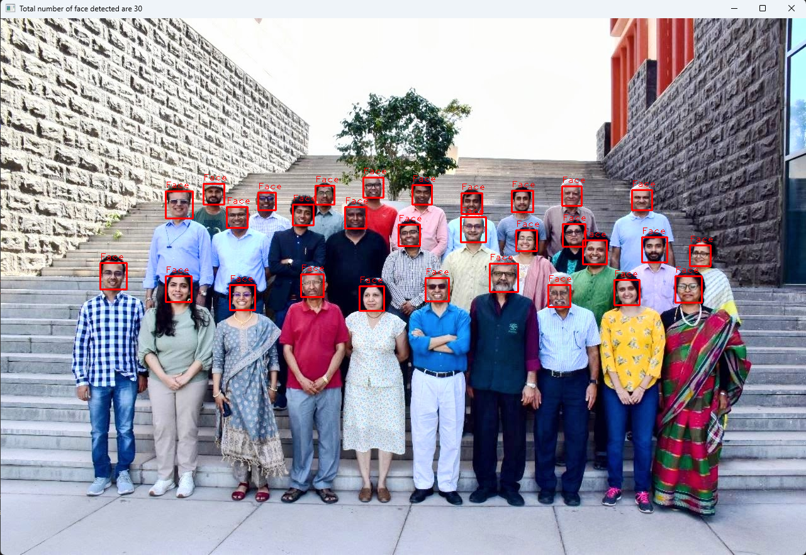
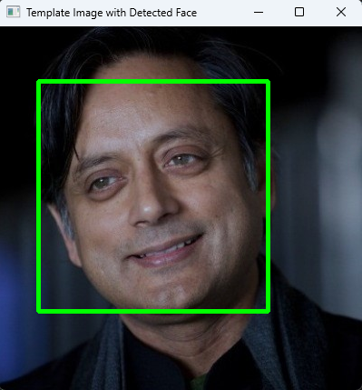
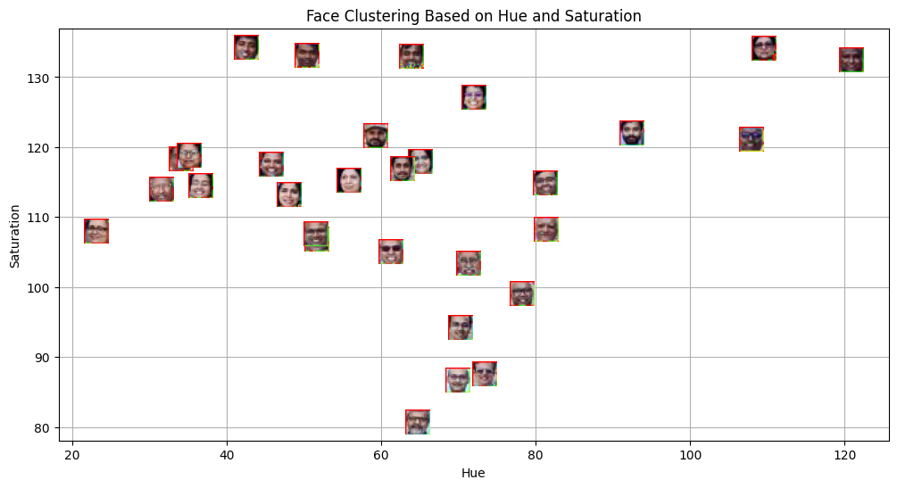
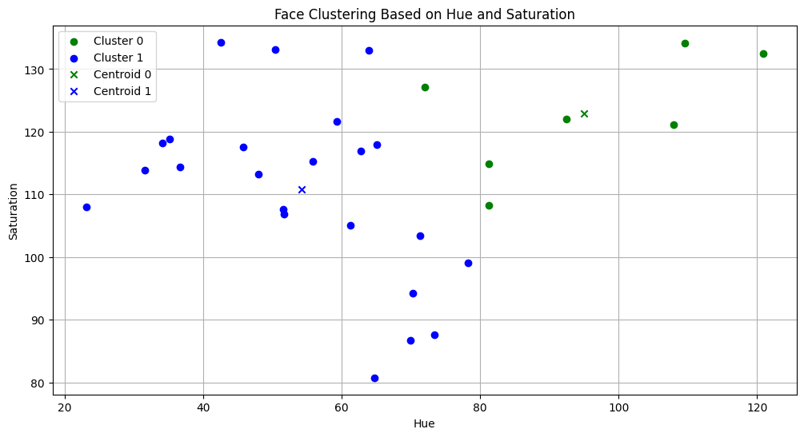
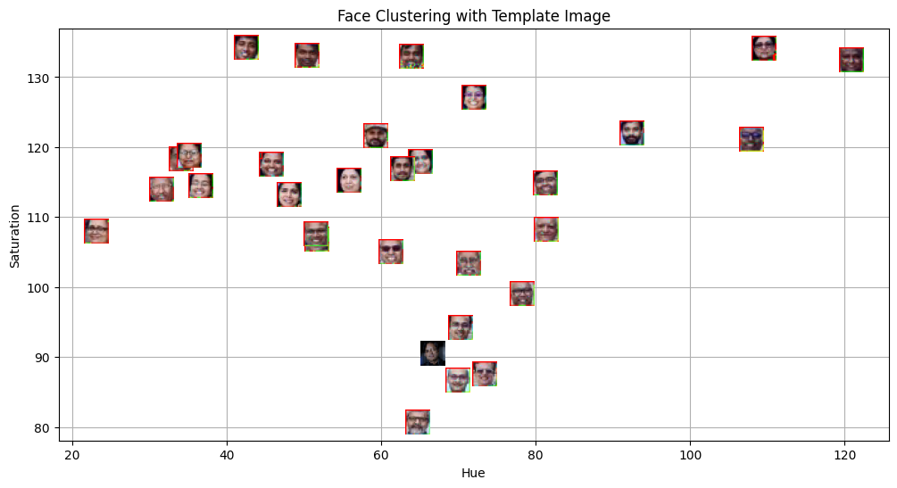
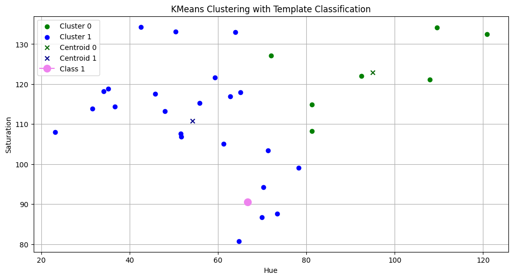

# Machine Learning and Pattern Recognition

## Lab 5 - Face Detection and KMeans Clustering Based Classification

### By Niksh Hiremath (ID: U20240158)

---

## Aim

The aim of this lab is to:

- Detect human faces in images using a pre-trained face detector
- Extract color based features from detected faces
- Apply KMeans clustering on facial features
- Perform template based classification using a reference face
- Visualise clustering results using 2D feature plots

---

## Methodology

1. **Face Detection**  
   Haar Cascade classifier was used to detect faces in:
   - A group faculty image
   - A template reference image

2. **Feature Extraction**  
   For each detected face:
   - The face region was cropped
   - Converted from BGR to HSV color space
   - Mean Hue and Saturation values were computed
   - Each face was represented as a 2D feature vector

3. **Clustering Using KMeans**
   - KMeans with $k = 2$ was applied
   - Faces were grouped into two clusters
   - Cluster centroids were calculated

4. **Template Based Classification**
   - A template face was processed similarly
   - Its Hue and Saturation features were computed
   - The template was mapped to the nearest cluster

---

## Visualisations and Results

### 1. Face Detection on Group Image

A total of 30 faces were detected in the faculty image.

---

### 2. Template Face Detection

The template image was successfully detected.

---

### 3. Face Clustering Based on Hue and Saturation

Each detected face was plotted in a 2D feature space using:

- X axis: Hue
- Y axis: Saturation

---

### 4. KMeans Cluster Plot with Centroids

Faces were grouped into two clusters and centroids were visualised.

---

### 5. Clustering with Template Face Included

The template face was projected into the same feature space.

---

### 6. Final KMeans Classification Plot

The template face was assigned to the nearest cluster.

---

## Key Findings

- Haar Cascade successfully detected all visible faces in the group image.
- Hue and Saturation provide a simple but effective low dimensional feature representation.
- KMeans clearly separated faces into two distinct color based clusters.
- The template face was correctly mapped to one of the clusters based on feature similarity.
- Visualization in 2D feature space made cluster separation clearly interpretable.

---

## Conclusions

Classical computer vision techniques can be combined with unsupervised learning for simple face based grouping.

Using HSV color features allowed dimensionality reduction while retaining meaningful visual characteristics. KMeans clustering grouped faces based on similarity in color distribution.

Template based classification showed how a new sample can be assigned to a cluster using distance to centroids.
